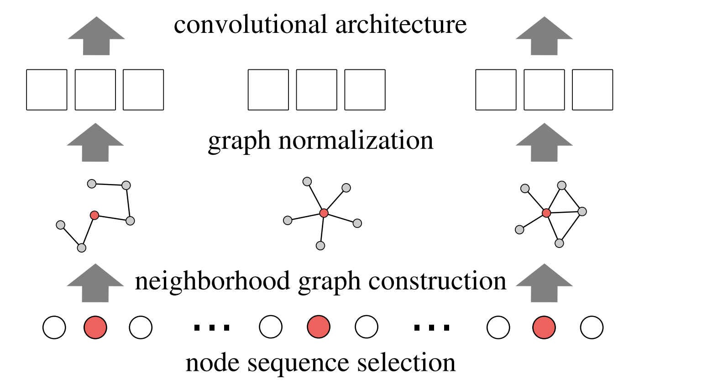

# Roadmap-for-GNNs

My own summary of the GNN's development.

图神经网络致力于将传统神经网络的成功从欧式空间的数据，迁移到非欧式空间数据--图上。我粗浅的整理了图神经网络的发展历程，并为每个阶段的研究重点附上了代表性的论文。

欧式空间的数据（如图片、自然语言、语音等）具有平移不变性和局部性，这正是传统深度学习模型成功的重要特性，也是图数据所缺乏的。

> In CNNs, the trainable local filters enable the automatic extraction of high-level features. The computation with filters requires a fixed number of ordered units in the receptive fields. However, the number of neighboring units is neither fixed nor are they ordered in generic graphs, thereby hindering the applications of convolutional operations.

因此，人们开始探索如何固定邻居节点、如何对节点排序来将图数据转化为欧式空间的数据。这类代表有：

1. PATCHYSAN:[http://proceedings.mlr.press/v48/niepert16.pd](http://proceedings.mlr.press/v48/niepert16.pdf)

   > For each input graph, it first determines nodes (and their order) forwhich neighborhood graphs are created. For each of these nodes, a neighborhood consisting of exactly k nodes is extracted and normalized, that is, it is uniquely mapped to a space with a fixed linear order. The normalized neighborhood serves as the receptive field for a node under consideration. Finally, feature learning components such as convolutional and dense layers are combined with the normalized neighborhood graphs as the CNN’s receptive fields.
   >

   
2. LGCN:[https://dl.acm.org/doi/pdf/10.1145/3219819.3219947](https://dl.acm.org/doi/pdf/10.1145/3219819.3219947)

> LGCL automatically selects a fixed number of neighboring nodes for each feature based on value ranking in order to 		   ransform graph data into grid-like structures in 1-D format, thereby enabling the use of regular convolutional operations on   generic graphs.

Finally, 推荐一篇图卷积神经网络的方法和应用的综述：

[https://www.sciencedirect.com/science/article/pii/S2666651021000012](https://www.sciencedirect.com/science/article/pii/S2666651021000012)

未完，等待GNNs新的重大进展...
